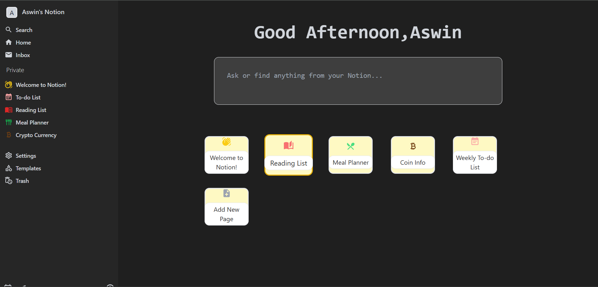
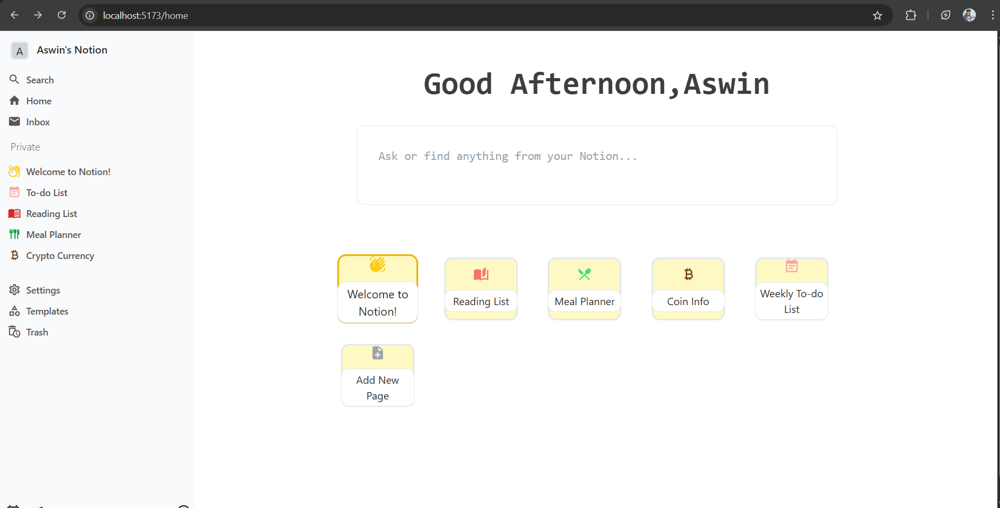
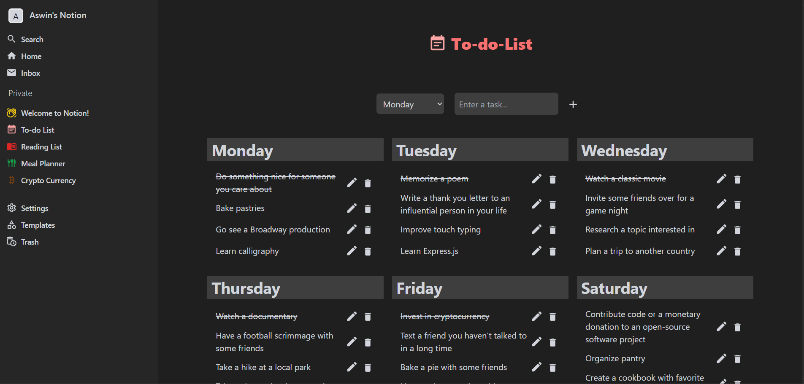
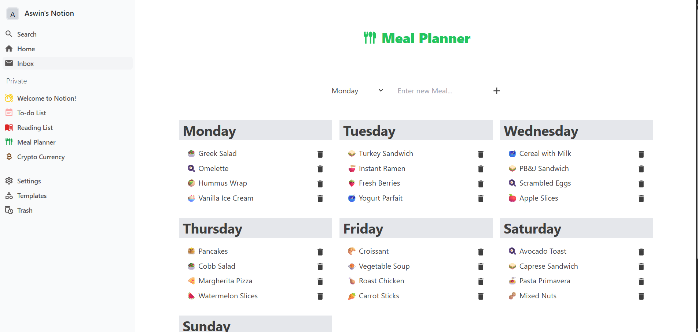
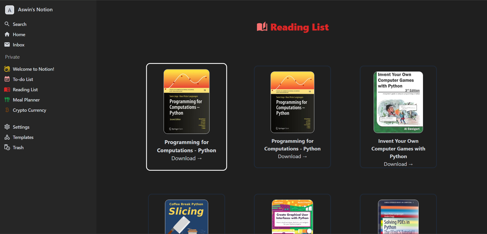
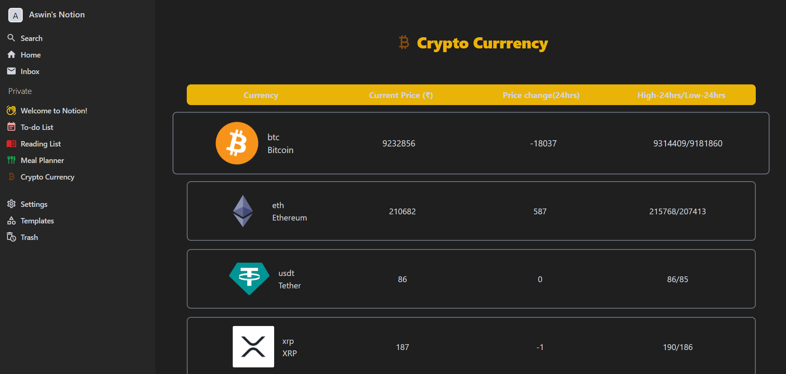

# 🧠 Notion Clone App

This is a Notion-inspired productivity web app built with **React + Vite**. It offers a clean and modern interface for personal organisation, planning, reading, and learning — all in one place.

## 🚀 Features

### ✅ Core Features
- 🌓 **Dark/Light Theme Toggle** – Automatically remembered across sessions.
- 📁 **Resizable Sidebar** – Adjust the width of the sidebar as you like.

### 🔐 Authentication
- 🔐 **Firebase Authentication** – Register, Login, and Logout functionality using Firebase.

### 📋 To-Do List
- ➕ Add tasks for each day of the week
- ✏️ Edit or update existing tasks
- ✅ Toggle task completion
- 🗑️ Delete tasks

### 🍱 Meal Planner
- 📅 Plan meals for the week
- ➕ Add, ✏️ Edit, and 🗑️ Delete meals
- Organised view by weekday

### 📚 Reading Page
- 📖 Browse books from online sources
- ⬇️ Download books to read
- Clean and readable UI for reading books

### 🪙 Cryptocurrency Page
- 📈 View real-time prices of cryptocurrencies
- 💰 Learn basic details of different crypto coins
- Auto-refreshing coin data with visuals

## 📷 Screenshots

### 🌓 Dark Mode UI

### ✅ Todo List Feature

### 🍽️ Meal Planner

### 📚 Reading Page

### 🪙 Crypto Tracker

## 🛠️ Tech Stack

- ⚛️ **React.js** (with Vite)
- 🧠 **Redux Toolkit & Context API** – State management
- 🎨 **Tailwind CSS** – Styling & Responsive designing
- ☁️ **Firebase** – Auth and backend integration
- 📦 **React Router** – Navigation
- 📚 **External APIs** – For books and crypto data using React Query
- 💤 **React Lazy/Suspense** – Lazy load components
- 🛡️ **react-error-boundary** – Graceful error handling

## 🧪 Coming Soon
- 📊 Analytics page
- 📄 Expand app with more planning and utility pages
- 📝 Rich text notes
- ⏰ Reminder and notification system

📜 License
This project is licensed under the MIT License.

🙌 Inspiration
Inspired by Notion, this project aims to combine productivity tools, planning features, and reading/learning resources into one modern app.

